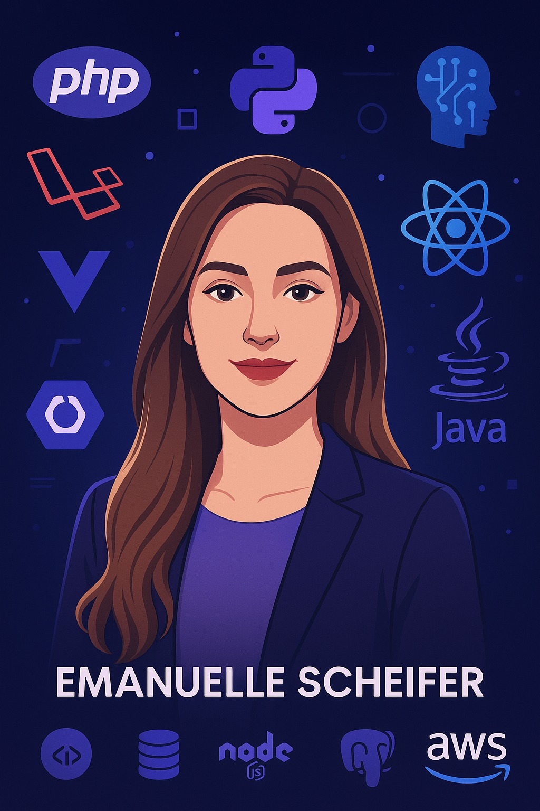

<!-- Banner -->

  

<!-- Animated Title -->

  

---

### 👩‍💻 About Me

I am a **Software Engineer** with experience in **full-stack development**, **system architecture**, and **product-oriented engineering**.  
I transform complex problems into **elegant, scalable, and high-impact solutions**, with strong focus on **performance, usability, and real-world value**.

I work across **backend (PHP/Laravel, Node.js, Java/Spring Boot)** and **frontend (Vue.js, React, TypeScript)** ecosystems, building robust applications, API integrations, SaaS platforms, and AI-powered systems.

🌟 **Purpose-driven engineering with measurable outcomes**  
🧠 **Applied AI and intelligent automation**  
☁️ **Experience with distributed, scalable cloud architectures**  
🔄 **Agile mindset focused on delivery and continuous improvement**  

---

### 🚀 Featured Projects

| Project | Description |
|----------|------------|
| 💼 **Agilizza Services** | SaaS platform that automates management between service providers and clients — built with Laravel & Vue 3, supporting payments, scheduling, and multi-tenant architecture. |
| 🧬 **Intelligent Diagnosis System** | AI-based medical support system using Python and OpenCV for image processing and computer vision in health diagnostics. |
| ⚙️ **API Integration Dashboard** | Real-time monitoring panel for REST APIs and webhooks, enabling data flow tracking and event observability. |

---

### 💼 Tech Stack  

#### 💻 Frontend  
 
Vue.js (3.5+), React, TypeScript, Pinia, PrimeVue, KeenThemes.

#### ⚙️ Backend  
 
PHP (Laravel), Node.js (Express), Java (Spring Boot).

#### 🗄️ Databases  
 
MySQL, MariaDB, PostgreSQL, MongoDB.

#### ☁️ DevOps & Infrastructure  
 
Docker, Docker Compose, Azure, AWS.

#### 🧰 Tools  
 
Git (GitHub / GitLab), Jira, Figma, Postman, Maven, PNPM, Yarn.

#### 🧠 AI & Data Science  
 
Python (OpenCV, scikit-learn, matplotlib, skimage), MATLAB.

#### 🧩 Best Practices  
SOLID, Clean Architecture, Design Patterns (Repository, Service, Factory, Observer), TDD.

#### 🔄 Agile Methodologies  
Scrum and Kanban — focused on **clarity, adaptability, and consistent delivery**.

#### 💡 Soft Skills  
Assertive and results-oriented profile (DISC – D), with strong analytical thinking, leadership, communication, innovation mindset, and ability to bridge technical and business perspectives.

---

### 📊 GitHub Stats  

<h2 align="center">
  💜 <strong>+3,000 contributions in private projects using PHP (Laravel) and Vue.js</strong> 💻
</h2>

  

---

### 📬 Contact  

---

  <h3><strong>“Building the future through technology, innovation, and real-world impact.”</strong> 💜</h3>
   
  

